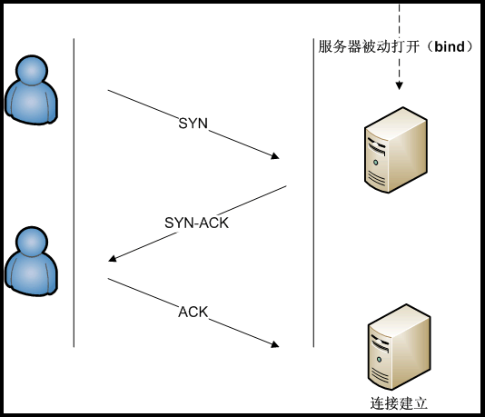

### lo
```
localhost loopback
127.0.0.1
```

### MASK
```
遮罩
A級 255.0.0.0
B級 255.255.0.0
C級 255.255.255.0
```

### IP
```
IPv4 
192.168.xxx.xxx/24
以0做結尾 網路
以255做結尾 廣播
```

### 網卡
```
08:00:27:xx:xx:xx
前三個為廠商編號
後三個為網卡編號 唯一性
```

### MTU
```
Maximum Transmission Unit
最大傳輸單位

原文網址：https://kknews.cc/tech/qjlzzey.html

```

### port

|port|描述|
|---|:---:|
|20|FTP,預設|
|21|FTP,控制|
|22|SSH|
23|telnet
53|DNS
80|HTTP

https://zh.wikipedia.org/wiki/TCP/UDP%E7%AB%AF%E5%8F%A3%E5%88%97%E8%A1%A8


### TCP

```
TCP three way handshake
syn -> syn.ack -> ack

https://zh.wikipedia.org/wiki/%E4%BC%A0%E8%BE%93%E6%8E%A7%E5%88%B6%E5%8D%8F%E8%AE%AE
```
